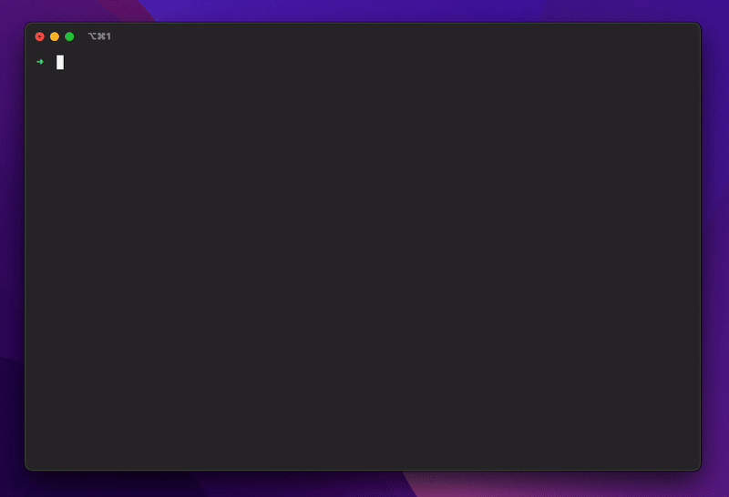

# dotfiles

My zsh configuration for development, installable with a single command.



## Getting started

### How to install

```bash
curl -sL https://raw.githubusercontent.com/lluissm/dotfiles/main/install.sh | sh
```

### Custom configuration

To add custom configurations that will not get overridden every time you update the .zshrc file, create a `~/.zcustom` file and it will be automatically sourced.

## What it does

### Add functions

- `mkcd`: create a folder (if it does not exist) and cd to it.
- `exists`: check if a command exists.
- `info`: used by this script to notify what is being installed.
- `warn`: used by this script to warn the user.

### Install and configure OhMyZsh

Install and setup plugins from ohmyzsh:

- [git](https://github.com/ohmyzsh/ohmyzsh/tree/master/plugins/git): alias and functions for git.
- [zsh-navigation-tools](https://github.com/ohmyzsh/ohmyzsh/tree/master/plugins/zsh-navigation-tools): set of tools for navigating through history, etc.

Install custom plugins

- [zsh-syntax-highlighting](https://github.com/zsh-users/zsh-syntax-highlighting): syntax highlighting for the shell zsh.
- [zsh-autosuggestions](https://github.com/zsh-users/zsh-autosuggestions): suggests commands as you type based on history and completions.

### Add aliases

- `zshconfig`: open ~/.zshrc in vscode.
- `starshipconfig`: open ~/.config/starship.toml in vscode.
- `zcustomconfig`: open ~/.zcustom in vscode.
- `cls`: clear.
- `ll`: list all files (with colors).
- `update_dotfiles`: download latest dotfiles from git and install (does not source .zshrc).
- `starship-preset-nerd-fonts`: apply nerd font symbols preset to starship.
- `starship-preset-no-nerd-font`: apply no nerd font preset to starship.
- `starship-preset-plain-text`: apply plain text symbols preset to starship.
- `starship-preset-custom`: apply custom starship configuration from dotfiles.
- `install-fonts`: install JetBrains Mono fonts (macOS only).

### Install dev tools

Install (if not already installed):

- [direnv](https://direnv.net/): load and unload environment variables depending on the current directory.
- [brew](https://brew.sh/): package manager for OSX.
- [git-utils](https://github.com/lluissm/git-utils.git): clone and update git.repos in bulk.

### Install and configure Starship prompt

Install [starship](https://starship.rs/) prompt, a minimal, blazing-fast, and infinitely customizable prompt for any shell built in rust.

Configure starship with a custom starship.toml file inspired by the [plain text preset](https://starship.rs/presets/plain-text.html) to avoid the need of custom fonts and improve legibility. Some unnecessary plugins have been disabled to improve performance.
